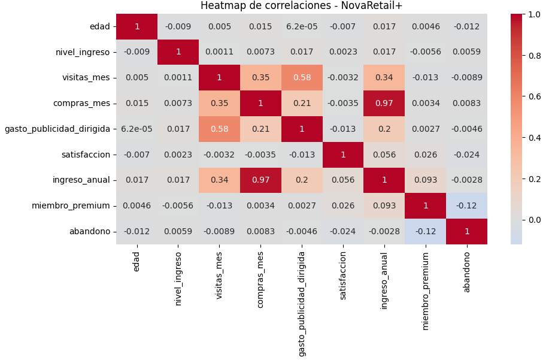
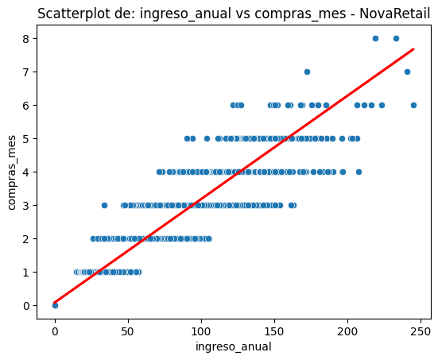
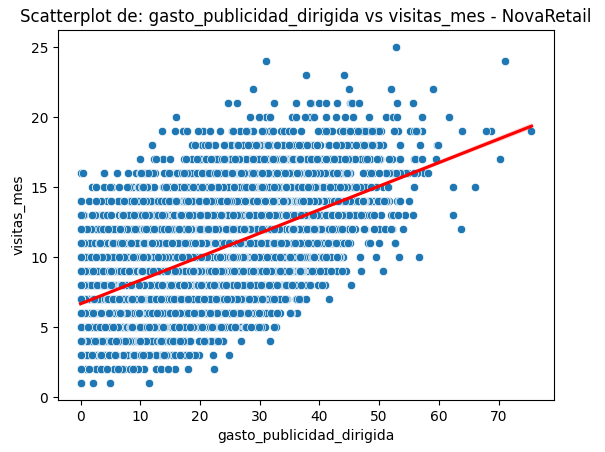
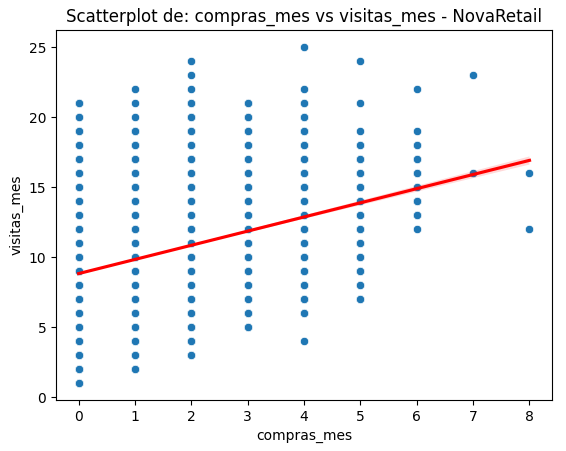
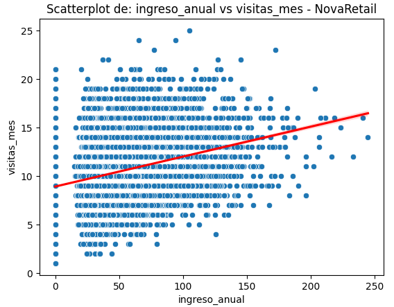
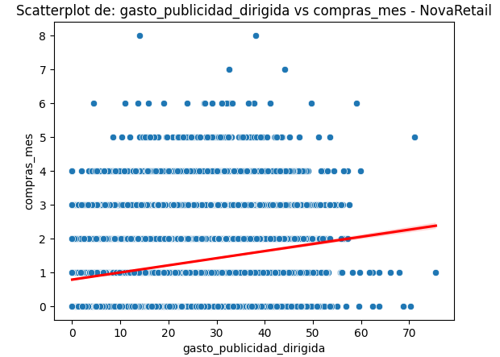
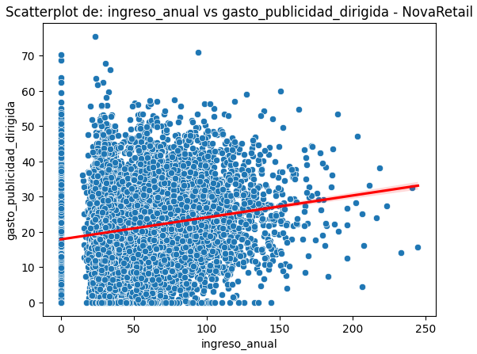

# NovaRetail+ — Customer Behavior Correlation Analysis
> Identifying which customer behavior factors are most strongly associated with annual revenue for a Latin American e-commerce platform.

---

## Table of Contents
1. [Executive Summary](#executive-summary)
2. [Business Storytelling (SCQA)](#business-storytelling-scqa)
3. [Project Objectives](#project-objectives)
4. [Tech Stack](#tech-stack)
5. [Dataset](#dataset)
6. [Project Workflow](#project-workflow)
7. [Repository Structure](#repository-structure)
8. [Key Visualizations](#key-visualizations)
9. [Key Insights (C→F→I)](#key-insights-cfi)
10. [Business Recommendations](#business-recommendations)
11. [How to Reproduce](#how-to-reproduce)
12. [Future Improvements](#future-improvements)
13. [Lessons Learned](#lessons-learned)
14. [Author](#author)

---

## Executive Summary
NovaRetail+ is a Latin American e-commerce platform with millions of users. For the close of 2024, the Growth and Retention team needed to know which customer behavior factors were most strongly associated with **annual revenue** (`ingreso_anual`), without falling into causal overreach.

A full correlational analysis was run on 15,000 customer records combining engagement metrics (visits, purchases), targeted advertising spend, satisfaction, membership status, churn, device type, and region.

The analysis found that **monthly purchases** is by far the strongest driver of revenue (Pearson r = 0.967), while intuitively "strong" levers like targeted advertising and premium membership status show only weak-to-moderate associations. These findings reframe where growth effort should be concentrated.

---

## Business Storytelling (SCQA)
- **S (Situation):** NovaRetail+ tracks behavioral and transactional data for 15,000 customers to understand what drives the revenue each customer generates for the company.
- **C (Complication):** Not all commonly assumed revenue drivers behave as expected — advertising spend and premium membership show only weak-to-moderate statistical association with revenue, despite being core growth levers.
- **Q (Question):** Which customer behaviors are actually most strongly associated with annual revenue, and which assumed drivers should be reconsidered?
- **A (Answer):** Monthly purchase frequency is overwhelmingly the strongest correlate of revenue. Visits and advertising spend matter mainly as upstream contributors to purchases, not as direct revenue levers. Premium membership and churn have statistically significant but practically small associations.

---

## Project Objectives

### General Objective
Identify and quantify the customer behavior factors most strongly associated with annual revenue at NovaRetail+ using a correlational, non-causal analytical framework.

### Specific Objectives
- Apply the correlation technique appropriate to each variable type: Pearson/Spearman (numeric–numeric), point-biserial (binary–numeric), and Cramér's V (categorical–categorical).
- Visualize relationships through heatmaps and scatterplots to distinguish real patterns from misleading ones (e.g., Simpson's paradox).
- Document assumptions and limitations explicitly to avoid causal overreach.
- Translate statistical findings into actionable, risk-aware business recommendations.

---

## Tech Stack
- Python
- Jupyter Notebook
- pandas, numpy
- seaborn, matplotlib
- scipy (`pointbiserialr`, `chi2_contingency`)
- Git, GitHub

---

## Dataset

| Attribute   | Description |
|-------------|-------------|
| Source      | `novaretail_comportamiento_clientes_2024.csv` |
| Records     | 15,000 customers, no missing values |
| Features    | 12 columns: demographics, engagement, advertising, satisfaction, membership, churn, device, region, annual revenue |
| Time Period | 2024 |
| Granularity | One row per customer |

> Column names are kept in Spanish (e.g., `ingreso_anual`, `compras_mes`, `visitas_mes`) per the project's data standard. Full descriptions are documented inside the notebook.

---

## Project Workflow

```text
Load & Explore Dataset → Prepare Data & Document Assumptions → Visualize Relationships
→ Calculate Correlation Coefficients → Interpret Results for the Business → Limitations & Next Steps
```

---

## Repository Structure

```text
Project-NovaRetail/
├── data/
│   └── raw/
│       └── novaretail_comportamiento_clientes_2024.csv
├── images/
│   ├── e1-heatmap-correlaciones.png
│   ├── e2-scatterplot-ingreso-anual-vs-compras-mes.png
│   ├── e3-scatterplot-gasto-publicidad-dirigida-vs-visitas-mes.png
│   ├── e4-scatterplot-compras-mes-vs-visitas-mes.png
│   ├── e5-scatterplot-ingreso-anual-vs-visitas-mes.png
│   ├── e6-scatterplot-gasto-publicidad-dirigida-vs-compras-mes.png
│   └── e7-scatterplot-ingreso-anual-vs-gasto-publicidad-dirigida.png
├── Project-NovaRetail.ipynb
├── README.md
├── requirements.txt
└── .gitignore
```

---

## Key Visualizations

**Global correlation heatmap** — overview of all numeric relationships in the dataset:



**Strongest relationship found** — `ingreso_anual` vs. `compras_mes` (Pearson r = 0.967):



**Other numeric relationships analyzed**, ordered by correlation strength (see [Key Insights](#key-insights-cfi) for interpretation):

`gasto_publicidad_dirigida` vs. `visitas_mes` (r = 0.579):



`compras_mes` vs. `visitas_mes` (r = 0.354):



`ingreso_anual` vs. `visitas_mes` (r = 0.337):



`gasto_publicidad_dirigida` vs. `compras_mes` (r = 0.208):



`ingreso_anual` vs. `gasto_publicidad_dirigida` (r = 0.197):



---

## Key Insights (C→F→I)
> Each insight follows the **Cause → Finding → Impact/Action** chain, connecting data to business decisions.

### Insight 1 — Purchases Are the Dominant Revenue Driver
- **Cause:** Annual revenue is generated directly through transactional activity.
- **Finding:** `compras_mes` correlates almost perfectly with `ingreso_anual` (Pearson r = 0.967, Spearman ρ = 0.967).
- **Impact / Recommended Action:** Growth initiatives should prioritize increasing purchase frequency above all other engagement metrics — it is the single strongest lever identified.

### Insight 2 — Advertising Spend Drives Visits, Not Revenue Directly
- **Cause:** Targeted advertising is designed to increase platform traffic.
- **Finding:** `gasto_publicidad_dirigida` shows a moderate correlation with `visitas_mes` (r = 0.579) but only a weak direct correlation with `ingreso_anual` (r = 0.197) and `compras_mes` (r = 0.208).
- **Impact / Recommended Action:** Evaluate advertising performance on visit-to-purchase conversion, not on direct revenue attribution — the causal chain runs through visits and purchases, not straight to revenue.

### Insight 3 — Visits Convert to Purchases at a Moderate Rate
- **Cause:** More visits create more purchase opportunities.
- **Finding:** `visitas_mes` vs. `compras_mes` correlation is moderate (r = 0.354); `visitas_mes` vs. `ingreso_anual` is weaker (r = 0.337).
- **Impact / Recommended Action:** Traffic growth alone will not proportionally grow revenue. Conversion-rate optimization on existing traffic may be more efficient than acquiring new visits.

### Insight 4 — Premium Membership Has a Small but Significant Edge
- **Cause:** Premium subscribers are assumed to have differentiated purchasing behavior.
- **Finding:** Point-biserial correlation between `miembro_premium` and `ingreso_anual` is low (0.093, p < 0.001) — statistically significant but practically small. Premium members represent only ~11% of the customer base.
- **Impact / Recommended Action:** Don't treat premium status as a strong revenue predictor by itself; instead, design purchase-based incentives that encourage premium members to buy more often.

### Insight 5 — Churn Is Rare and Not Explained by Low Satisfaction Alone
- **Cause:** Churn (`abandono`) might be expected to concentrate among dissatisfied users.
- **Finding:** Churn affects only 1.15% of users, while roughly 79% of the total customer base (premium and regular combined) reports satisfaction scores of 4–5.
- **Impact / Recommended Action:** Retention efforts should look beyond satisfaction scores to explain churn, since the current data does not support satisfaction as its main cause.

### Insight 6 — Mobile Dominates Across All Regions
- **Cause:** Mobile is the primary access channel for e-commerce in the region.
- **Finding:** Cramér's V between `tipo_dispositivo` and `region` is very low (0.012), indicating no meaningful regional device preference — mobile represents ~55% of usage consistently across all four regions.
- **Impact / Recommended Action:** Prioritize mobile experience improvements globally rather than region-specific device strategies.

---

## Business Recommendations
- Focus growth initiatives on increasing purchase frequency — the strongest revenue lever identified.
- Reframe advertising KPIs around visit-to-purchase conversion rather than direct revenue attribution.
- Treat premium membership as a light signal, not a primary revenue driver; pair it with purchase-based incentives.
- Investigate churn drivers beyond satisfaction, since satisfaction alone does not explain the current (small) churn rate.
- Prioritize mobile-first improvements platform-wide, given its dominant and consistent share across regions.

---

## How to Reproduce
1. Clone the repository.
2. Create and activate a virtual environment.
3. Install dependencies: `pip install -r requirements.txt`.
4. Open `Project-NovaRetail.ipynb` in Jupyter Notebook.
5. Confirm the dataset path points to `data/raw/novaretail_comportamiento_clientes_2024.csv`.
6. Run all cells sequentially.

---

## Future Improvements
- Extend the segmentation analysis to further rule out Simpson's paradox in the premium-membership and churn findings.
- Test `miembro_premium` vs. `satisfaccion` and `abandono` vs. `satisfaccion` with deeper segmentation, focusing on active regular (`usuarios_normales`) customers.
- Explore predictive modeling (e.g., regression) once causal hypotheses are formally tested outside this correlational scope.

---

## Lessons Learned
- **Technical:** Applying the correlation method appropriate to each variable type (Pearson/Spearman, point-biserial, Cramér's V) is essential to avoid misleading conclusions.
- **Business:** Intuitive assumptions about "premium" and "loyal" customers were partially challenged by the data — strong-sounding levers don't always translate into strong statistical association.
- **Professional:** Documenting assumptions and limitations up front prevents overstating correlational findings as causal ones.

---

## Author

**Jacobo Galindo Ortiz**
Data Analyst Portfolio

[](https://www.linkedin.com/in/jacobo-galindo-ortiz)
[](https://github.com/JacoboGO)
[](https://public.tableau.com/app/profile/jacobo.galindo.ortiz/vizzes)
[](mailto:jacobo.galindo.ortiz@hotmail.com)

---

> *"Language is a window into the mind."*
> — Noam Chomsky

<div align="center">

⭐ If this project was useful to you, consider leaving a star
on the repository — it helps a lot and is greatly appreciated.

</div>

---

## Usage Notice

This repository is provided for portfolio and educational review purposes.

The project may be viewed to evaluate the analytical approach, methodology, and implementation. It is not intended for redistribution, commercial use, or incorporation into other projects without prior written permission from the author.

If you would like to reference or discuss any part of this work, please contact the author.
